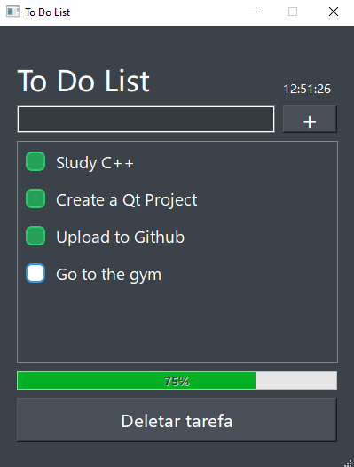

[Acesse a versão em inglês do README](README.md).

# Lista de Tarefas

Uma aplicação de lista de tarefas (To Do List) desenvolvida em C++ utilizando Qt Creator. Este projeto oferece uma interface gráfica intuitiva para gerenciamento de tarefas do dia a dia.

## Tecnologias Utilizadas

- **C++** - Linguagem de programação principal
- **Qt Creator** - Framework para desenvolvimento da interface gráfica
- **Qt Widgets** - Para criação da interface do usuário

## Funcionalidades

- **Adicionar Tarefas** - Crie novas tarefas na sua lista
- **Marcar como Concluída** - Marque tarefas que já foram finalizadas
- **Deletar Tarefas** - Remova tarefas que não são mais necessárias
- Interface gráfica amigável e fácil de usar

## Como Usar

1. Execute a aplicação
2. Digite uma nova tarefa no campo de entrada
3. Clique em "+ para incluir a tarefa na lista
4. Use os botões correspondentes para:
   - Marcar tarefa como concluída
   - Deletar tarefa da lista

## Requisitos do Sistema

- Qt Creator instalado
- Compilador C++ compatível
- Sistema operacional Windows/Linux/macOS

## Instalação e Execução

### Opção 1: Execução Direta

1. Clone este repositório
2. Navegue até `src/build/Desktop_Qt_6_9_1_MinGW_64_bit-Debug/`
3. Execute `qt_project.exe`

### Opção 2: Compilar a partir do Código Fonte

1. Clone este repositório
2. Abra o projeto no Qt Creator
3. Compile e execute o projeto
